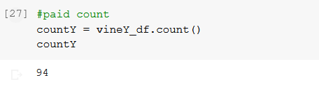
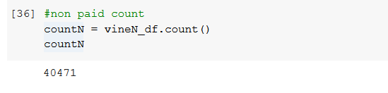
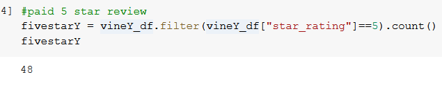
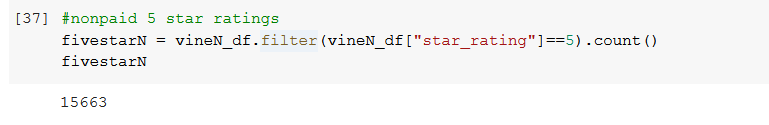
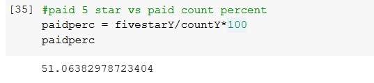
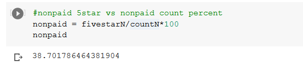

# amazon_vine_analysis

### Purpose
  The purpose of this analysis was to utilize hadoop, spark and AWS to practice building a cloud database. The data was hosted from AWS from an S3 bucket that would be comprised of amazon user reviews upon the subject of my choosing, videogames. Using AWS RDS, I created a PostgreSQL database and linked the cloud database into my local PGadmin as server. WIth the help of Google collab notebooks, I was able to extract, transform, and load the cleaned and parsed dataframes into PGadmin under the AWS server. The analysis largely delt with Vine user program that Amazon provied and determining if there were any relationship between paid 5-star reviews, and nonpaid 5-star reviews.
  
  
### Results
  To better assist our analysis, the given raw data was filtered for relevancy to the analysis. The data was first fitered for total votes being larger or at 20 ber review item, and then fitered again so that total votes divided by th total of helpful votes were above 50%.
  

  ##### Using the code above, I was able to determine the number of paid votes were 94 and rest of the large majority were unpaid.
  

  ###### Observing the code above tells us that paid 5 star reviews totalled out to be only 48 and and nonpaid 5 stars totalled out to be over 15000.
  

  
  ###### From the data above we can see that the percent of 5 star paid reviews is above 50% and that the nonpaid 5 star reviews was just about 39%

### Summary
  Upon reviewing the results one can see that percent of paid 5 star reviews bears some interest as they're above 50% comparing to the 39% of unpaid reviews. One can come to the conclusion that there is some possible bias to the paid reviews, however it is important to note that the total size of reviews compared to one another is not one to one. In order to further vaidate this possible claim one could open up the filtering model to allow for a more even size between the two dataframes, if with the open dataframes there is still a higher 5 star review percentage for paid over non paid the possible exisitence of bias toward paid review stands. Another analysis that coult shed light of possible bias could be determining the relationship between to filter filter by verified purchase to furter add validity to each review.
